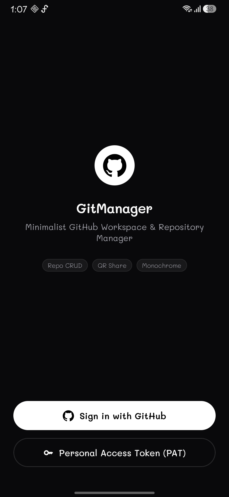
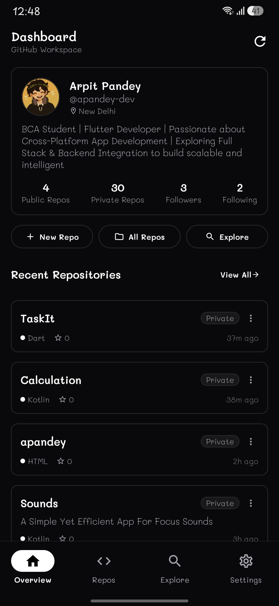
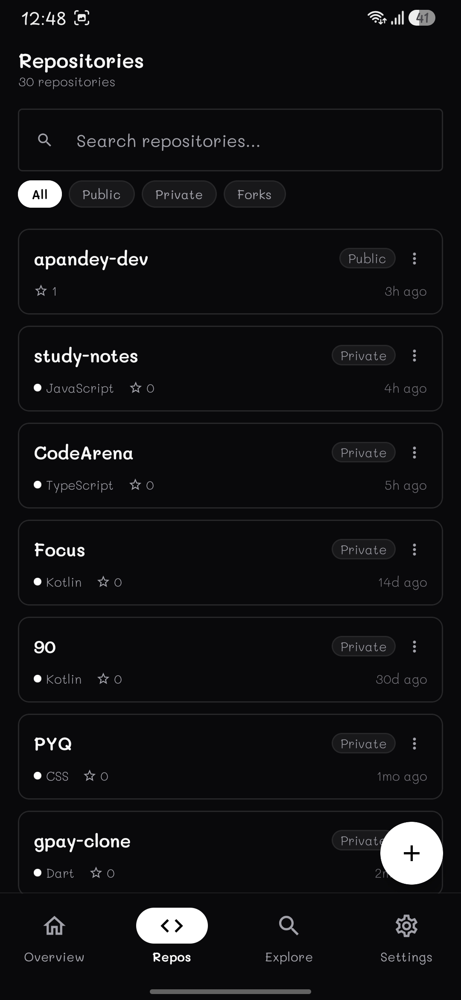
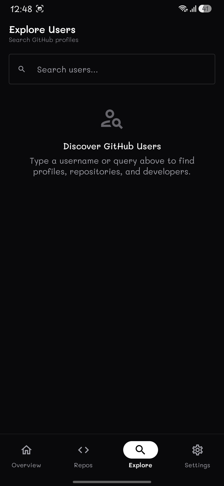
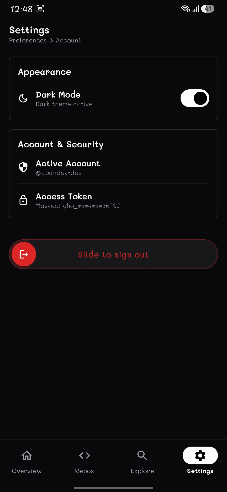
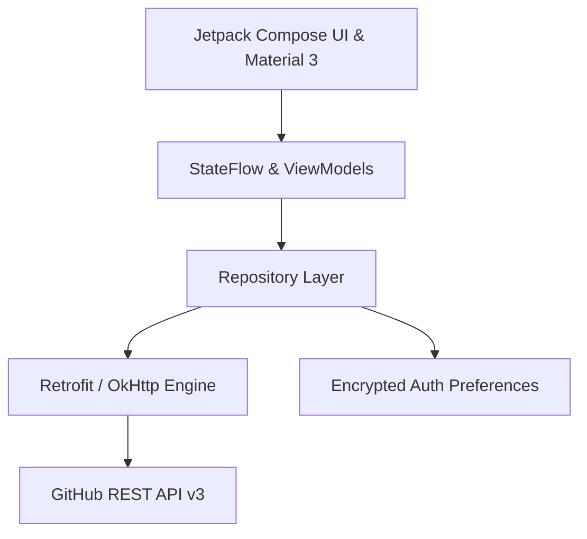

<div align="center">

# 🐙 GitManager

**Minimalist, High-Performance GitHub Account & Repository Manager for Android**

[](https://kotlinlang.org)
[](https://developer.android.com/jetpack/compose)
[](https://m3.material.io)
[](LICENSE)
[](https://www.android.com)

_A clean, distraction-free monochrome GitHub manager featuring full repository CRUD, offline QR sharing, explore engine, custom Mali typography, and native GitHub OAuth/PAT authentication._

</div>

---

## 🌟 Highlights & Philosophy

- **🖤 Minimalist Monochrome Aesthetic**: Clean Day (Light) default theme with a toggleable Dark Mode, refined 8–10dp borders, and custom lightweight **Mali Typography** (Light, Regular, Medium, SemiBold).
- **⚡ Zero-Delay In-Memory Sync**: Real-time optimistic state mutations for instant repository creation, editing, and deletion with zero lag.
- **🛡️ Secure GitHub Authentication**:
  - **1-Click OAuth Web Flow**: Native browser authorization with animated identity confirmation overlay.
  - **Personal Access Token (PAT)**: Pre-configured 1-tap scope generator (`repo`, `user`, `delete_repo`) with an interactive iOS-style **Slide-to-Authenticate** button.
- **📱 Offline QR & Card Sharing**: Instant offline QR code generator and shareable monochrome repo cards for any public or private repository.
- **🔍 Global Developer Search**: Search GitHub users worldwide with instant profile insights, follower counts, and public repositories.
- **🔒 Smart Permission Enforcement**: Edit and Delete controls are strictly protected and automatically hidden for repositories you don't own.

---

## 📸 App Screenshots

<div align="center">
  <table>
    <tr>
      <td align="center"><b>Login & OAuth</b></td>
      <td align="center"><b>Dashboard</b></td>
      <td align="center"><b>Repositories</b></td>
      <td align="center"><b>Explore Users</b></td>
      <td align="center"><b>Settings</b></td>
    </tr>
    <tr>
      <td></td>
      <td></td>
      <td></td>
      <td></td>
      <td></td>
    </tr>
  </table>
</div>

---

## ⚡ Key Features


### 1. 🐙 Native GitHub Authentication

- **OAuth Web Flow**: Authorize directly via GitHub in your browser with smooth deep-linking (`gitmanager://oauth`).
- **Interactive Authenticating Animation**: Fullscreen animated pulsing Octocat logo with dynamic verification status updates while exchanging tokens.
- **Personal Access Token Slider**: Enter any GitHub classic PAT with custom pre-configured permissions.

### 2. 📁 Comprehensive Repository Management (CRUD)

- **Create**: Create public or private repositories with custom descriptions directly from the app.
- **Edit**: Real-time editing of repo names, descriptions, and privacy status with custom modal bottom sheets.
- **Delete**: Safe permanent deletion with double-confirmation modal sheets.
- **Star / Unstar**: One-tap toggling with live counter updates.
- **README Viewer**: Built-in Base64 decoded Markdown README reader.

### 3. 📱 Repository QR Codes & Social Cards

- Live offline QR code rendering for any repository URL.
- One-tap link copying and system sharing.
- Generate and export clean preview cards to showcase your projects.

### 4. 🧭 User Discovery & Search

- Paginated real-time GitHub user search with avatar caching.
- Deep dive into any developer's public profile, bio, location, followers, and public repositories.

### 5. 🎛️ Settings & Account Control

- Toggle between Monochrome Day and Dark themes with instant DataStore persistence.
- Masked token security indicator.
- **Slide to Sign Out**: iOS-style draggable gesture button with danger feedback.

---

## 🏗️ Architecture & Tech Stack



- **UI Framework**: [Jetpack Compose](https://developer.android.com/jetpack/compose) (Material 3 components, Navigation Compose)
- **Language**: [Kotlin](https://kotlinlang.org/) (Coroutines, StateFlow, Flow)
- **Networking**: [Retrofit 2](https://square.github.io/retrofit/) + [OkHttp 4](https://square.github.io/okhttp/)
- **Image Loading**: [Coil](https://coil-kt.github.io/coil/) (Asynchronous image loading & circle crop)
- **QR Engine**: [ZXing Android Core](https://github.com/zxing/zxing)
- **Local Storage**: Android SharedPreferences & Encrypted Datastore
- **Typography**: Custom **Mali** font family (Google Fonts)

---

## 🚀 Getting Started

### Prerequisites

- Android Studio Ladybug (2024.2+) or newer
- JDK 17+
- Android SDK 24+ (Android 7.0 Nougat or higher)

### Installation & Build

1. **Clone the repository**:

   ```bash
   git clone https://github.com/apandey-dev/gitmanager.git
   cd gitmanager
   ```

2. **Configure GitHub OAuth (Optional for 1-Click Login)**:
   - Register an OAuth App on [GitHub Developer Settings](https://github.com/settings/applications/new).
   - Set **Authorization callback URL** to: `gitmanager://oauth`
   - Paste your `OAUTH_CLIENT_ID` and `OAUTH_CLIENT_SECRET` in [`Constants.kt`](app/src/main/java/com/gitmanager/app/core/utils/Constants.kt).

3. **Build and Install Debug APK**:

   ```bash
   # Windows PowerShell
   .\gradlew.bat assembleDebug

   # Install directly to connected device
   adb install -r app\build\outputs\apk\debug\app-debug.apk
   ```

---

## 📦 Releases

Pre-compiled APKs are available in the **[Releases](../../releases)** section:

- **`app-debug.apk`**: Direct debug build for testing on any Android device.

---

## 🤝 Contributing

Contributions, issues, and feature requests are welcome!

1. Fork the project.
2. Create your feature branch (`git checkout -b feature/AmazingFeature`).
3. Commit your changes (`git commit -m 'Add some AmazingFeature'`).
4. Push to the branch (`git push origin feature/AmazingFeature`).
5. Open a Pull Request.

---

## 📄 License

This project is licensed under the MIT License - see the [LICENSE](LICENSE) file for details.

<div align="center">
  <sub>Crafted with minimalist precision in Kotlin & Jetpack Compose.</sub>
</div>
