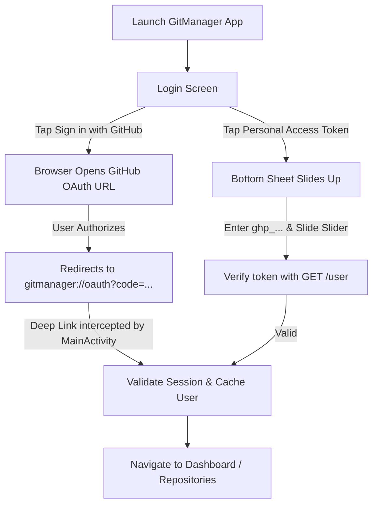

# GitManager — Comprehensive Setup & Integration Guide 🛠️

This document explains everything about setting up, configuring GitHub APIs/OAuth, creating Personal Access Tokens (PAT), and running the **GitManager** Android application.

---

## 📑 Table of Contents
1. [Where & What to Configure (API / Constants)](#1-where--what-to-configure)
2. [Option A: GitHub OAuth App Setup (One-Click Web Sign-In)](#2-option-a-github-oauth-app-setup)
3. [Option B: Personal Access Token (PAT) Setup (Instant Slider Login)](#3-option-b-personal-access-token-pat-setup)
4. [How the Authentication Flow Works](#4-how-the-authentication-flow-works)
5. [Building & Running via Wireless Debugging (ADB)](#5-building--running-via-wireless-debugging)
6. [Architecture & Key File Locations](#6-architecture--key-file-locations)

---

## 1. Where & What to Configure

All endpoint and OAuth credentials are concentrated in a single configuration file:
📍 [`app/src/main/java/com/gitmanager/app/core/utils/Constants.kt`](file:///C:/Users/arpit/Desktop/gitmanager/app/src/main/java/com/gitmanager/app/core/utils/Constants.kt)

```kotlin
object Constants {
    // Base API Endpoint for GitHub REST API v3
    const val GITHUB_API_BASE_URL = "https://api.github.com/"
    
    // GitHub OAuth Authorization & Token URLs
    const val GITHUB_OAUTH_AUTHORIZE_URL = "https://github.com/login/oauth/authorize"
    const val GITHUB_OAUTH_TOKEN_URL = "https://github.com/login/oauth/access_token"

    // 🔑 Replace with your GitHub OAuth App Client ID
    const val OAUTH_CLIENT_ID = "YOUR_GITHUB_CLIENT_ID_HERE"
    
    // Deep Link Redirect URI configured in AndroidManifest.xml
    const val OAUTH_REDIRECT_URI = "gitmanager://oauth"
    
    // Required Permissions (Repositories, User profile, Deletion)
    const val OAUTH_SCOPES = "repo,user,delete_repo,read:org"

    const val DEFAULT_PAGE_SIZE = 30
    const val PREFS_NAME = "git_manager_auth_prefs"
    const val KEY_ACCESS_TOKEN = "access_token"
    const val KEY_CACHED_USER = "cached_user"
    const val KEY_DARK_THEME = "dark_theme"
}
```

---

## 2. Option A: GitHub OAuth App Setup

If you want users to log in with a single tap on **"Sign in with GitHub"**:

1. Log into your GitHub account on [github.com](https://github.com).
2. Go to **Settings** (top right profile icon -> Settings).
3. In the left sidebar, scroll down to **Developer settings** -> **OAuth Apps**.
4. Click **New OAuth App** (or *Register a new application*):
   - **Application name**: `GitManager`
   - **Homepage URL**: `https://github.com` (or your portfolio website)
   - **Application description**: `Minimalist Monochrome GitHub Repository Manager`
   - **Authorization callback URL**: `gitmanager://oauth` ⚠️ *(Must match `OAUTH_REDIRECT_URI`)*
5. Click **Register application**.
6. Copy the **Client ID** and paste it into [`Constants.kt`](file:///C:/Users/arpit/Desktop/gitmanager/app/src/main/java/com/gitmanager/app/core/utils/Constants.kt) under `OAUTH_CLIENT_ID`.

---

## 3. Option B: Personal Access Token (PAT) Setup

For instant, direct access without setting up an OAuth server or app:

1. Open [github.com/settings/tokens](https://github.com/settings/tokens).
2. Click **Generate new token** -> **Generate new token (classic)**.
3. Set **Note**: `GitManager Android App`.
4. Set **Expiration**: Choose 90 days, 1 year, or No expiration.
5. Check the following scopes:
   - ✅ `repo` (Full control of private and public repositories)
   - ✅ `user` (Update and read user profile data)
   - ✅ `delete_repo` (Optional: needed if you wish to delete repositories from the app)
6. Click **Generate token**.
7. In the GitManager app:
   - Tap **"Personal Access Token (PAT)"** button.
   - Paste the token (`ghp_xxxxxxxxxxxxxxxxxxxx`).
   - Drag the iOS-style slider **"Slide to authenticate"** to log in instantly.

---

## 4. How the Authentication Flow Works



---

## 5. Building & Running via Wireless Debugging

1. **Verify your Android device is connected via ADB**:
   ```bash
   adb devices
   ```
2. **Compile the Debug APK**:
   ```powershell
   .\gradlew assembleDebug
   ```
3. **Install the APK on your device**:
   ```powershell
   adb install -r "app\build\outputs\apk\debug\app-debug.apk"
   ```
4. **Launch the Application**:
   ```powershell
   adb shell am start -n com.gitmanager.app/.MainActivity
   ```

---

## 6. Architecture & Key File Locations

| File | Purpose |
| :--- | :--- |
| [`SlideToAuthenticateButton.kt`](file:///C:/Users/arpit/Desktop/gitmanager/app/src/main/java/com/gitmanager/app/ui/components/SlideToAuthenticateButton.kt) | iOS-style draggable monochrome slider with progress fill and haptic state. |
| [`LoginScreen.kt`](file:///C:/Users/arpit/Desktop/gitmanager/app/src/main/java/com/gitmanager/app/ui/screens/auth/LoginScreen.kt) | Minimalist hero login screen with dual pill buttons & PAT modal bottom sheet. |
| [`Constants.kt`](file:///C:/Users/arpit/Desktop/gitmanager/app/src/main/java/com/gitmanager/app/core/utils/Constants.kt) | Central configuration for Client ID, URLs, scopes, and storage keys. |
| [`GitHubApiService.kt`](file:///C:/Users/arpit/Desktop/gitmanager/app/src/main/java/com/gitmanager/app/core/network/GitHubApiService.kt) | Retrofit API interface for GitHub REST v3 endpoints (User, Repos CRUD, Search, QR, Stars). |
| [`AuthPreferences.kt`](file:///C:/Users/arpit/Desktop/gitmanager/app/src/main/java/com/gitmanager/app/core/datastore/AuthPreferences.kt) | Local persistence of access token and user cache. |
| [`QrCodeGenerator.kt`](file:///C:/Users/arpit/Desktop/gitmanager/app/src/main/java/com/gitmanager/app/core/utils/QrCodeGenerator.kt) | ZXing QR bitmap generator. |
| [`ShareUtils.kt`](file:///C:/Users/arpit/Desktop/gitmanager/app/src/main/java/com/gitmanager/app/core/utils/ShareUtils.kt) | Generates and shares stylized monochrome repo preview cards. |
